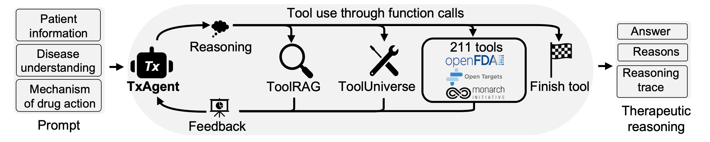

# TxAgent: An AI agent for therapeutic reasoning across a universe of tools

[](https://zitniklab.hms.harvard.edu/TxAgent)
[](https://arxiv.org/pdf/2503.10970)
[](https://pypi.org/project/txagent/)
[](https://pypi.org/project/tooluniverse/)
[](https://github.com/mims-harvard/TxAgent)
[](https://github.com/mims-harvard/ToolUniverse)
[](https://huggingface.co/collections/mims-harvard/txagent-67c8e54a9d03a429bb0c622c)

<body>
    <section class="hero">
      <div class="hero-body">
        <div class="container is-max-desktop">
          <div class="columns is-centered">
            <div class="column has-text-centered">
              <div class="is-size-5 publication-authors">
                <!-- Paper authors -->
                <span class="author-block">
                  <a href="https://shgao.site" target="_blank">Shanghua Gao</a
                  >,</span
                >
                <span class="author-block">
                  <a
                    href="https://www.linkedin.com/in/richard-zhu-4236901a7/"
                    target="_blank"
                    >Richard Zhu</a
                  >,</span
                >
                <span class="author-block">
                  <a href="https://zlkong.github.io/homepage/" target="_blank"
                    >Zhenglun Kong</a
                  >,</span
                >
                <span class="author-block">
                  <a href="https://www.ayushnoori.com/" target="_blank"
                    >Ayush Noori</a
                  >,</span
                >
                <span class="author-block">
                  <a
                    href="https://scholar.google.com/citations?hl=zh-CN&user=Awdn73MAAAAJ"
                    target="_blank"
                    >Xiaorui Su</a
                  >,</span
                >
                <span class="author-block">
                  <a
                    href="https://www.linkedin.com/in/curtisginder/"
                    target="_blank"
                    >Curtis Ginder</a
                  >,</span
                >
                <span class="author-block">
                  <a href="https://sites.google.com/view/theo-t" target="_blank"
                    >Theodoros Tsiligkaridis</a
                  >,</span
                >
                <span class="author-block">
                  <a href="https://zitniklab.hms.harvard.edu/" target="_blank"
                    >Marinka Zitnik</a
                  >
              </div>

## Overview



Precision therapeutics require multimodal adaptive models that generate personalized treatment recommendations. We introduce TxAgent, an AI agent that leverages multi-step reasoning and real-time biomedical knowledge retrieval across [a toolbox of 211 tools to analyze drug interactions, contraindications, and patient-specific treatment strategies](https://github.com/mims-harvard/ToolUniverse).

- TxAgent evaluates how drugs interact at molecular, pharmacokinetic, and clinical levels, identifies contraindications based on patient comorbidities and concurrent medications, and tailors treatment strategies to individual patient characteristics, including age, genetic factors, and disease progression.
- TxAgent retrieves and synthesizes evidence from multiple biomedical sources, assesses interactions between drugs and patient conditions, and refines treatment recommendations through iterative reasoning. It selects tools based on task objectives and executes structured function calls to solve therapeutic tasks that require clinical reasoning and cross-source validation.
- The ToolUniverse consolidates 211 tools from trusted sources, including all US FDA-approved drugs since 1939 and validated clinical insights from Open Targets.

TxAgent outperforms leading LLMs, tool-use models, and reasoning agents across five new benchmarks: DrugPC, BrandPC, GenericPC, TreatmentPC, and DescriptionPC, covering 3,168 drug reasoning tasks and 456 personalized treatment scenarios.

- It achieves 92.1% accuracy in open-ended drug reasoning tasks, surpassing GPT-4o by up to 25.8% and outperforming DeepSeek-R1 (671B) in structured multi-step reasoning.
- TxAgent generalizes across drug name variants and descriptions, maintaining a variance of &lt; 0.01 between brand, generic, and description-based drug references, exceeding existing tool-use LLMs by over 55%.

By integrating multi-step inference, real-time knowledge grounding, and tool- assisted decision-making, TxAgent ensures that treatment recommendations align with established clinical guidelines and real-world evidence, reducing the risk of adverse events and improving therapeutic decision-making.

## Setups

**Dependency**:

```
- An H100 GPU with more than 80GB of memory is recommended when running TxAgent. 
- ToolUniverse requires a device with an internet connection.
H100 环境配置：
vi  /usr/local/lib/python3.11/dist-packages/txagent/txagent.py
self.model = LLM(
    model=self.model_name,
    gpu_memory_utilization=0.70,  # 稍低于量化方案
    max_model_len=32768,           # 32K上下文（FP16下更安全）
    quantization=None,             # 禁用量化
    tensor_parallel_size=1,
    dtype="float16",               # 保持FP16
    enable_chunked_prefill=True,
    max_num_batched_tokens=16384,  # 降低批处理规模
    max_num_seqs=6,                # 减少并行序列数
    block_size=16,
    swap_space=16,
)

AMD mi300 环境配置：
所有操作在docker 内部操作：

docker pull rocm/vllm:rocm6.3.1_vllm_0.8.5_20250513

= b07754949af6

docker run -it \
   --network=host \
   --group-add=video \
   --ipc=host \
   --cap-add=SYS_PTRACE \
   --security-opt seccomp=unconfined \
   --device /dev/kfd \
   --device /dev/dri \
   -v /root/TxAgent:/app/model \
   b07754949af6 \
   bash


在docker 内部安装环境

git clone https://github.com/mims-harvard/TxAgent.git

cd  TxAgent

pip install .
#如果有cuda 报错，删除，应该不会报错；


pip install tooluniverse


python run.py --config metadata_config_test_txagentfp16.json

python -c "import torch; print(f'PyTorch {torch.__version__}, ROCm {torch.version.hip}')"


# 1. 共享会话（两人同时操作）
screen -S shared_session  # 主机创建
screen -x shared_session  # 另一终端接入

# 2. 记录所有操作（审计/复盘）
screen -L -S record_session  # 日志存screenlog.0

# 3. 分屏操作（需编译时启用）
Ctrl+a → |    # 垂直分屏
Ctrl+a → Tab  # 切换分屏


```

**Install ToolUniverse**:

```
# Install from source code:
git clone https://github.com/mims-harvard/ToolUniverse.git
cd ToolUniverse
python -m pip install . --no-cache-dir
OR
# Install from pip:
pip install tooluniverse

```

**Install TxAgent**:

```
# Install from source code:
git clone https://github.com/mims-harvard/TxAgent.git
python -m pip install . --no-cache-dir
OR
# Install from pip:
pip install txagent

```

**Run the example**:

```
python run_example.py
```

**Run the gradio demo**:

```
python run_txagent_app.py
```

### Pretrained models

Pretrained model weights are available in [HuggingFace](https://huggingface.co/collections/mims-harvard/txagent-67c8e54a9d03a429bb0c622c).

| Model                                                                                   | Description              |
| --------------------------------------------------------------------------------------- | ------------------------ |
| [TxAgent-T1-Llama-3.1-8B](https://huggingface.co/mims-harvard/TxAgent-T1-Llama-3.1-8B)     | TxAgent LLM              |
| [ToolRAG-T1-GTE-Qwen2-1.5B](https://huggingface.co/mims-harvard/ToolRAG-T1-GTE-Qwen2-1.5B) | Tool RAG embedding model |

## Demo cases

Please visit [project page](https://github.com/mims-harvard/TxAgent) for more details.


## Citation

```
@misc{gao2025txagent,
      title={TxAgent: An AI Agent for Therapeutic Reasoning Across a Universe of Tools}, 
      author={Shanghua Gao and Richard Zhu and Zhenglun Kong and Ayush Noori and Xiaorui Su and Curtis Ginder and Theodoros Tsiligkaridis and Marinka Zitnik},
      year={2025},
      eprint={2503.10970},
      archivePrefix={arXiv},
      primaryClass={cs.AI},
      url={https://arxiv.org/abs/2503.10970}, 
}
```

## Contact

If you have any questions or suggestions, please email [Shanghua Gao](mailto:shanghuagao@gmail.com) and [Marinka Zitnik](mailto:marinka@hms.harvard.edu).
