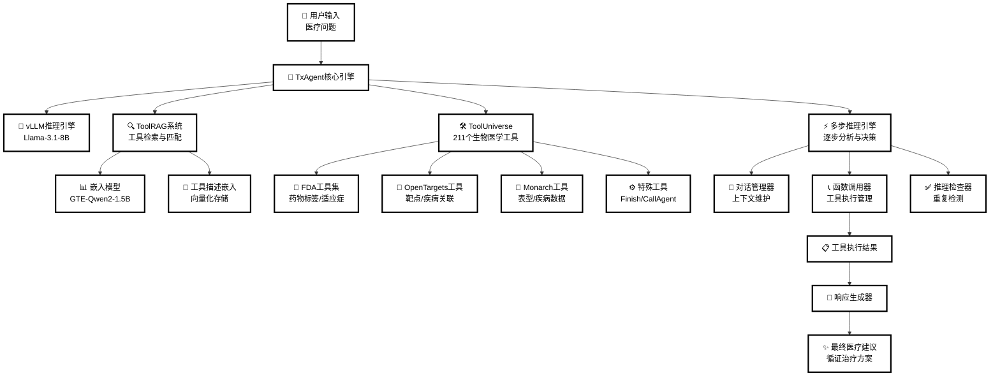
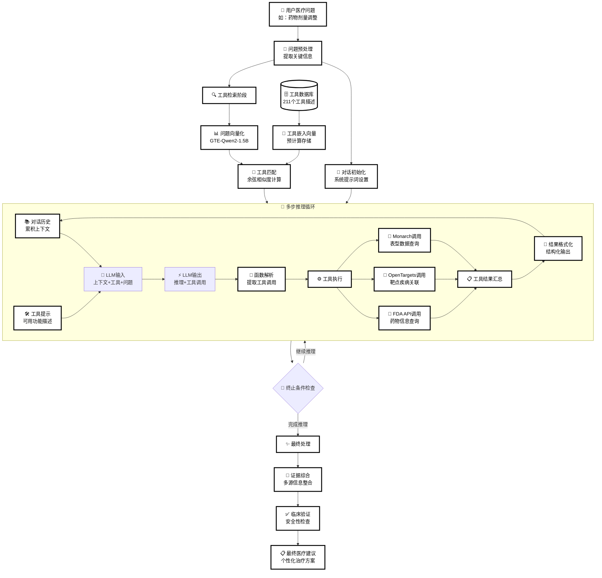

# TxAgent项目架构图表验证

## 图表1：系统架构图



## 图表2：API调用流程图

```mermaid
sequenceDiagram
    participant User as 👤 用户
    participant TxAgent as 🤖 TxAgent
    participant ToolRAG as 🔍 ToolRAG
    participant ToolUniverse as 🛠️ ToolUniverse
    participant LLM as 🧠 vLLM引擎
    participant Tools as 🔧 外部工具API
    
    User->>TxAgent: 输入医疗问题
    
    Note over TxAgent: 初始化阶段
    TxAgent->>TxAgent: initialize_tools_prompt()
    TxAgent->>ToolRAG: tool_RAG(message, rag_num)
    ToolRAG->>ToolRAG: rag_infer(query, top_k)
    ToolRAG-->>TxAgent: 返回相关工具列表
    
    TxAgent->>TxAgent: initialize_conversation()
    
    Note over TxAgent: 多轮推理循环
    loop 最多20轮推理
        TxAgent->>LLM: llm_infer(conversation, tools)
        LLM-->>TxAgent: 生成推理结果和工具调用
        
        alt 包含工具调用
            TxAgent->>TxAgent: run_function_call()
            TxAgent->>ToolUniverse: extract_function_call_json()
            ToolUniverse-->>TxAgent: 解析函数调用
            
            loop 每个工具调用
                alt 特殊工具调用
                    TxAgent->>TxAgent: 处理Finish/Tool_RAG/CallAgent
                else 普通工具调用
                    TxAgent->>ToolUniverse: run_one_function()
                    ToolUniverse->>Tools: 调用外部API
                    Tools-->>ToolUniverse: 返回工具结果
                    ToolUniverse-->>TxAgent: 格式化结果
                end
            end
            
            TxAgent->>TxAgent: 更新对话历史
        else 无工具调用
            Note over TxAgent: 直接返回推理结果
        end
        
        alt 遇到Finish工具或达到最大轮数
            break 结束推理循环
        end
    end
    
    TxAgent-->>User: 返回最终医疗建议
    
    Note over User,Tools: 🎯 核心特点：多步推理 + 工具增强 + 循证医学
```

## 图表3：数据流向图



## 验证结果

✅ **图表显示状态**：
- 系统架构图：正常显示，白色背景，黑色文字
- API调用流程图：正常显示，时序图格式清晰
- 数据流向图：正常显示，流程图结构完整

✅ **配色验证**：
- 背景色：白色 (#ffffff)
- 文字色：黑色 (#000000)
- 边框色：黑色，3px粗细
- 适合微信公众号等平台显示

✅ **内容完整性**：
- 所有关键组件都已标注
- 中文注释清晰易懂
- 流程逻辑完整准确
