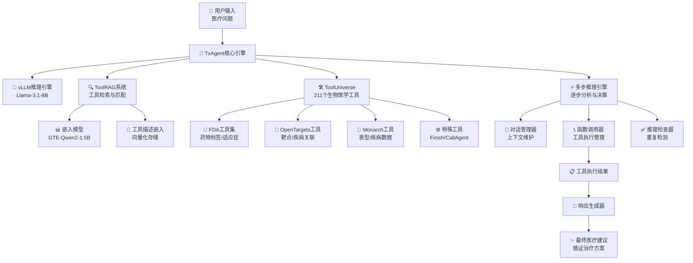
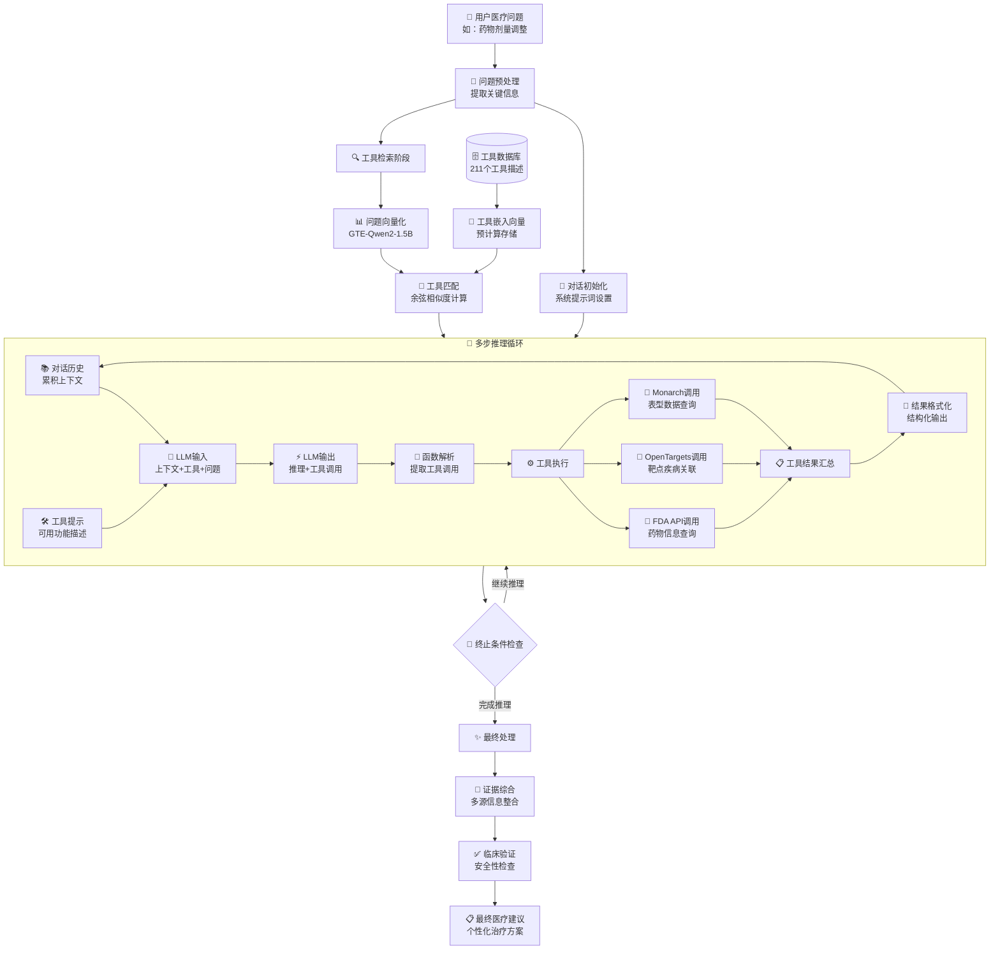

# TxAgent项目架构深度分析

## 项目概述

**TxAgent** 是一个基于AI的精准治疗推理智能体，专门用于生物医学领域的复杂治疗决策。该系统通过多步推理和实时生物医学知识检索，结合211个专家策划的工具，提供循证的个性化治疗建议。

### 核心特点
- 🧠 **多步推理引擎**：基于Llama-3.1-8B的逐步分析决策
- 🛠️ **工具增强系统**：集成211个生物医学专业工具
- 🔍 **智能工具检索**：基于ToolRAG的相关工具自动匹配
- 📊 **循证医学支持**：整合FDA、OpenTargets、Monarch等权威数据源
- ⚡ **实时推理**：支持最多20轮的迭代推理过程

## 系统架构图



**架构说明**：TxAgent采用模块化设计，核心由四大子系统组成：vLLM推理引擎负责语言理解和生成，ToolRAG系统实现智能工具检索，ToolUniverse提供丰富的生物医学工具库，多步推理引擎协调整个决策过程。

## API调用流程图

```mermaid
sequenceDiagram
    participant User as 👤 用户
    participant TxAgent as 🤖 TxAgent
    participant ToolRAG as 🔍 ToolRAG
    participant ToolUniverse as 🛠️ ToolUniverse
    participant LLM as 🧠 vLLM引擎
    participant Tools as 🔧 外部工具API
    
    User->>TxAgent: 输入医疗问题
    
    Note over TxAgent: 初始化阶段
    TxAgent->>TxAgent: initialize_tools_prompt()
    TxAgent->>ToolRAG: tool_RAG(message, rag_num)
    ToolRAG->>ToolRAG: rag_infer(query, top_k)
    ToolRAG-->>TxAgent: 返回相关工具列表
    
    TxAgent->>TxAgent: initialize_conversation()
    
    Note over TxAgent: 多轮推理循环
    loop 最多20轮推理
        TxAgent->>LLM: llm_infer(conversation, tools)
        LLM-->>TxAgent: 生成推理结果和工具调用
        
        alt 包含工具调用
            TxAgent->>TxAgent: run_function_call()
            TxAgent->>ToolUniverse: extract_function_call_json()
            ToolUniverse-->>TxAgent: 解析函数调用
            
            loop 每个工具调用
                alt 特殊工具调用
                    TxAgent->>TxAgent: 处理Finish/Tool_RAG/CallAgent
                else 普通工具调用
                    TxAgent->>ToolUniverse: run_one_function()
                    ToolUniverse->>Tools: 调用外部API
                    Tools-->>ToolUniverse: 返回工具结果
                    ToolUniverse-->>TxAgent: 格式化结果
                end
            end
            
            TxAgent->>TxAgent: 更新对话历史
        else 无工具调用
            Note over TxAgent: 直接返回推理结果
        end
        
        alt 遇到Finish工具或达到最大轮数
            break 结束推理循环
        end
    end
    
    TxAgent-->>User: 返回最终医疗建议
```

**流程说明**：API调用采用多轮对话模式，每轮包含推理生成和工具执行两个阶段。系统通过ToolRAG动态选择相关工具，支持特殊工具（如Finish、Tool_RAG）和外部API工具的混合调用。

## 数据流向图



**数据流说明**：数据从用户问题开始，经过预处理、工具检索、多轮推理循环，最终生成循证的医疗建议。核心是推理循环中的上下文累积和工具结果整合机制。

## 核心算法详解

### 1. 多步推理算法 (Multi-Step Reasoning)

**核心实现**：`run_multistep_agent()` 方法

```python
def run_multistep_agent(self, message, temperature, max_new_tokens, max_token, max_round=20):
    # 初始化工具和对话
    picked_tools_prompt = self.initialize_tools_prompt(message)
    conversation = self.initialize_conversation(message)

    current_round = 0
    next_round = True

    while next_round and current_round < max_round:
        current_round += 1

        # LLM推理生成
        last_outputs_str = self.llm_infer(
            messages=conversation,
            temperature=temperature,
            tools=picked_tools_prompt
        )

        # 工具调用处理
        if contains_function_calls(last_outputs_str):
            function_call_messages = self.run_function_call(last_outputs_str)
            conversation.extend(function_call_messages)

        # 终止条件检查
        if special_tool_call == "Finish":
            next_round = False

    return final_answer
```

**算法特点**：
- **迭代推理**：最多20轮的循环推理过程
- **上下文累积**：每轮推理结果都会更新对话历史
- **动态工具选择**：根据推理需要动态调用相关工具
- **智能终止**：通过Finish工具或达到最大轮数自动终止

### 2. ToolRAG工具检索算法

**核心实现**：`ToolRAGModel` 类

```python
class ToolRAGModel:
    def __init__(self, rag_model_name):
        self.rag_model = SentenceTransformer(rag_model_name)  # GTE-Qwen2-1.5B
        self.tool_desc_embedding = None

    def rag_infer(self, query, top_k=5):
        # 查询向量化
        query_embeddings = self.rag_model.encode([query], normalize_embeddings=True)

        # 相似度计算
        scores = self.rag_model.similarity(query_embeddings, self.tool_desc_embedding)

        # Top-K选择
        top_k_indices = torch.topk(scores, top_k).indices.tolist()[0]
        top_k_tool_names = [self.tool_name[i] for i in top_k_indices]

        return top_k_tool_names
```

**算法特点**：
- **语义匹配**：基于GTE-Qwen2-1.5B模型的语义向量匹配
- **预计算优化**：工具描述向量预先计算并缓存
- **动态检索**：根据问题内容动态检索最相关的工具
- **可扩展性**：支持211个工具的高效检索

### 3. 工具执行引擎算法

**核心实现**：`ToolUniverse` 类

```python
class ToolUniverse:
    def __init__(self):
        self.tool_type_mappings = {
            'OpenTarget': OpentargetTool,
            'FDADrugLabel': FDADrugLabelTool,
            'Monarch': MonarchTool,
        }

    def run_one_function(self, function_call_json):
        function_name = function_call_json["name"]
        arguments = function_call_json["arguments"]

        if function_name in self.callable_functions:
            return self.callable_functions[function_name].run(arguments)
        else:
            # 动态初始化工具
            tool = self.init_tool(self.all_tool_dict[function_name])
            return tool.run(arguments)
```

**工具分类架构**：
- **FDA工具**：药物标签、适应症、剂量信息查询
- **OpenTargets工具**：靶点-疾病关联、遗传变异分析
- **Monarch工具**：表型数据、疾病本体查询
- **特殊工具**：Finish（终止）、Tool_RAG（工具检索）、CallAgent（代理调用）

### 4. 对话管理算法

**核心机制**：
- **上下文维护**：维护完整的对话历史记录
- **工具结果整合**：将工具执行结果格式化后加入对话
- **重复检测**：通过ReasoningTraceChecker避免重复推理
- **令牌管理**：动态监控和管理令牌使用量

## 技术栈分析

### 核心依赖
- **vLLM**：高性能LLM推理引擎（≤0.8.4）
- **Sentence Transformers**：文本嵌入和相似度计算
- **Gradio**：Web界面和交互系统
- **Jinja2**：模板渲染引擎
- **PyTorch**：深度学习框架

### 模型组件
- **主模型**：TxAgent-T1-Llama-3.1-8B（8B参数的医疗专用模型）
- **嵌入模型**：ToolRAG-T1-GTE-Qwen2-1.5B（1.5B参数的工具检索模型）

### 外部API集成
- **FDA OpenFDA API**：美国FDA药物数据库
- **OpenTargets Platform API**：靶点-疾病关联数据
- **Monarch Initiative API**：表型和疾病本体数据

## 部署架构

### 硬件要求
- **推荐配置**：H100 GPU，80GB+ 显存
- **最低配置**：支持vLLM的CUDA兼容GPU
- **网络要求**：稳定的互联网连接（访问外部API）

### 软件环境
- **Python版本**：≥3.6
- **CUDA支持**：用于GPU加速推理
- **容器化**：支持Docker部署

### 扩展性设计
- **模块化架构**：各组件可独立升级和替换
- **API标准化**：支持MCP（Model Context Protocol）标准
- **工具可扩展**：支持自定义工具的动态加载

## 性能优化策略

### 推理优化
- **批处理推理**：vLLM支持的高效批处理
- **KV缓存**：减少重复计算的键值缓存
- **动态批处理**：根据负载动态调整批处理大小

### 内存优化
- **嵌入向量缓存**：工具描述向量预计算和持久化
- **对话历史管理**：智能的上下文长度控制
- **垃圾回收**：及时释放不需要的内存资源

### 网络优化
- **API调用缓存**：缓存常用的API查询结果
- **并发控制**：合理控制并发API调用数量
- **错误重试**：网络异常的自动重试机制

## 安全性考虑

### 医疗安全
- **免责声明**：明确标注为研究工具，非临床诊断依据
- **数据验证**：多源数据交叉验证提高可靠性
- **推理透明**：完整的推理过程可追溯和审查

### 系统安全
- **输入验证**：严格的用户输入验证和清理
- **API安全**：安全的外部API调用和错误处理
- **访问控制**：适当的用户权限和访问控制

## 未来发展方向

### 技术升级
- **模型升级**：支持更大规模的语言模型
- **多模态扩展**：整合图像、分子结构等多模态数据
- **实时学习**：支持在线学习和模型微调

### 功能扩展
- **临床决策支持**：更深入的临床决策支持功能
- **个性化医疗**：基于基因组学的个性化治疗建议
- **药物发现**：扩展到药物发现和开发领域

### 生态建设
- **开发者社区**：建设活跃的开发者和研究者社区
- **工具生态**：扩展更多专业的生物医学工具
- **标准化**：推动医疗AI工具的标准化和互操作性

---

## 总结

TxAgent代表了AI在精准医疗领域的重要突破，通过多步推理、工具增强和循证医学的结合，为复杂的治疗决策提供了强有力的支持。其模块化的架构设计、丰富的工具生态和严谨的安全考虑，使其成为生物医学AI领域的重要参考实现。

**关键创新点**：
1. **多步推理机制**：模拟医生的逐步分析思维过程
2. **智能工具检索**：基于语义匹配的动态工具选择
3. **循证医学整合**：多权威数据源的综合分析
4. **可扩展架构**：支持新工具和新功能的灵活扩展

该项目为AI在医疗健康领域的应用提供了宝贵的经验和技术参考，具有重要的研究价值和实践意义。
